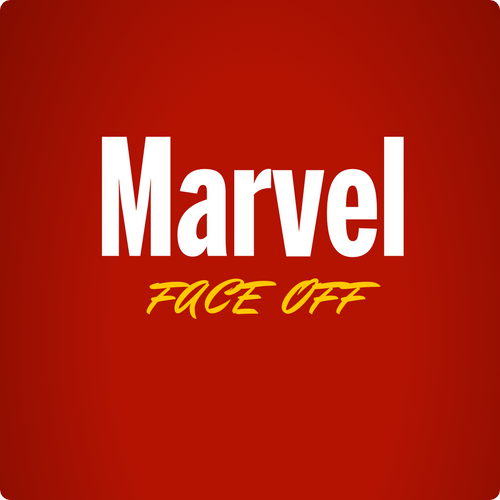
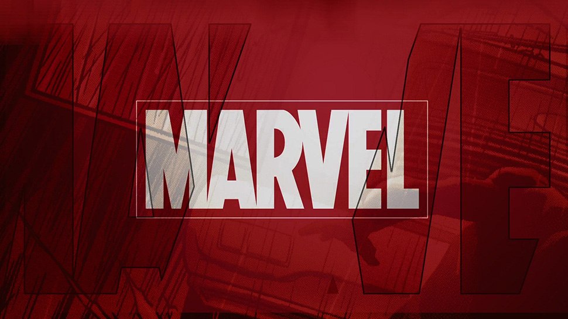

[](https://github.com/Marvel-Face-Off/MFO)
[](https://github.com/Marvel-Face-Off/MFO/issues)
[](https://github.com/Marvel-Face-Off/MFO/pulls)
[](https://opensource.org/licenses/MIT)



# Marvel face Off

An icebreaker game where players must answer sets of random questions choosing between two random Marvel characters generated from the Marvel API.
<br>
Created by [Michael Haviv](https://github.com/mhaviv), [David Yim](https://github.com/yimd85) and [Jovan Williams](https://github.com/JWilliams35).

## Rules

With a group of friends, the person playing can take turns answering a randomly selected
question based on the the two random Marvel characters that appear. Once a character is clicked, the person playing can continue on or choose another group member to take his/her turn.

If the two characters that appear are unknown, the person playing is allowed to roll again (this does not apply to questions based on appearance).

## Deployment

https://marvel-face-off.herokuapp.com/

<p>
	
</p>

## Local Installation

```bash
$ git clone https://github.com/Marvel-Face-Off/MFO.git
$ cd MFO
$ npm install
$ npm start
```

## Project Structure

```
.
├── public             # Where static assets are served
│   └── index.html     ## The main HTML file that includes the React code
├── src                # Source code, including raw assets
│   ├── App.js         ## The top-level component for React
│   ├── fonts          ## Fonts(eot|otf|ttf|woff|woff2)
│   ├── images         ## Images (gif|png|jpe?g|svg|ico)
│   ├── components     ## Any shared components
│   │    └── Heroes.js ### Where API call is held
│   └── index.js       ## Webpack entry point / component mounting
└── questions.txt      # Where sets of game questions are held
```

## Technology Used

<br>

* [Marvel API](https://developer.marvel.com/) allows developers everywhere to access information about Marvel's vast library of comics.
<br>

<hr><br>

<br>

* [React](https://reactjs.org/) A JavaScript library for building user interfaces.
<br>

## Credits

David Yim (contributor)
Michael Haviv (contributor)
Jovan Williams (contributor)

## Contribute
* Contributions are always welcome! Please read the [contribution guidelines](CONTRIBUTING.md) first.

## License
[](https://opensource.org/licenses/MIT)

* This frontend web application is available under the [MIT License](https://github.com/mhaviv/Marvel-Face-Off/MFO/blob/master/LICENSE.md)
